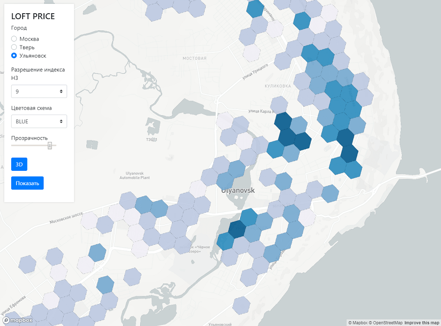
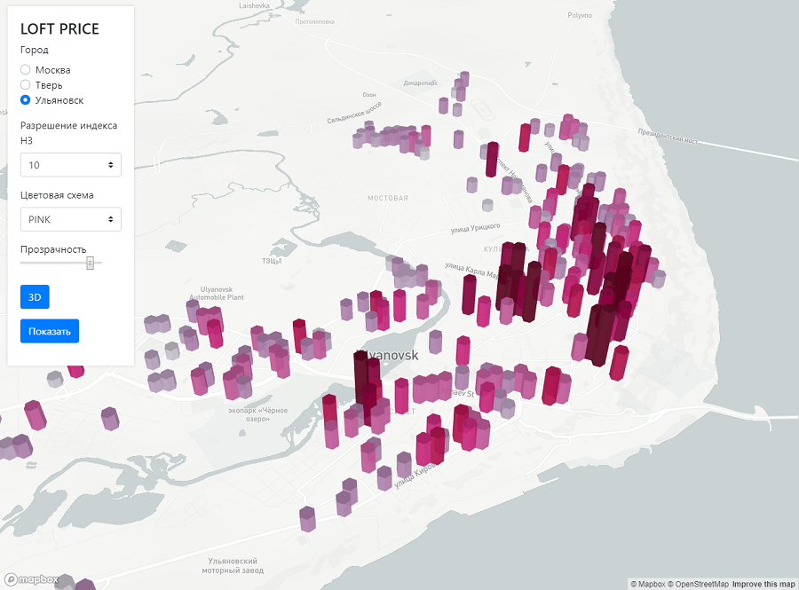

# LOFT PRICE
Web-приложение для визуализации стоимости аренды жилья на карте города

### Запуск

1. Клонировать репозиторий
    ```bash
    git clone https://github.com/UserNikita/loft_price.git
    ```
2. Перейти в папку проекта
3. Запустить докер контейнеры
    ```bash
    docker-compose up -d
    ```
4. Заполнить ClickHouse данными
    ```bash
   docker exec -ti web python loaddata.py 
   ```
5. Открыть в браузере страницу с адресом *http://127.0.0.1:5000*

### Сбор данных

Команда для сбора данных

```bash
docker exec -ti web scrapy crawl <spider> -a city=<city> -a rent=<rent>
```

`spider` - паук для сбора данных, доступные значения `avito` и `cian`

`city` - название города. Пример: `ulyanovsk`.
По умолчанию используется `ulyanovsk`

`rent` - типа аренды. 
Доступные значения: `day` - посуточно, `month` - на длительный срок, `forever` - покупка (доступно для avito). 
По умолчанию используется `month`.

### Скриншоты

